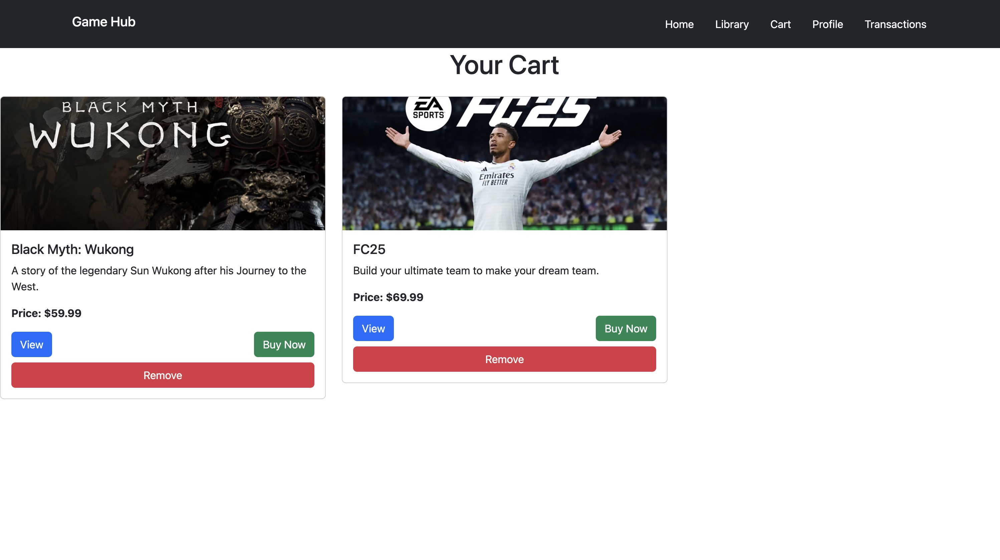
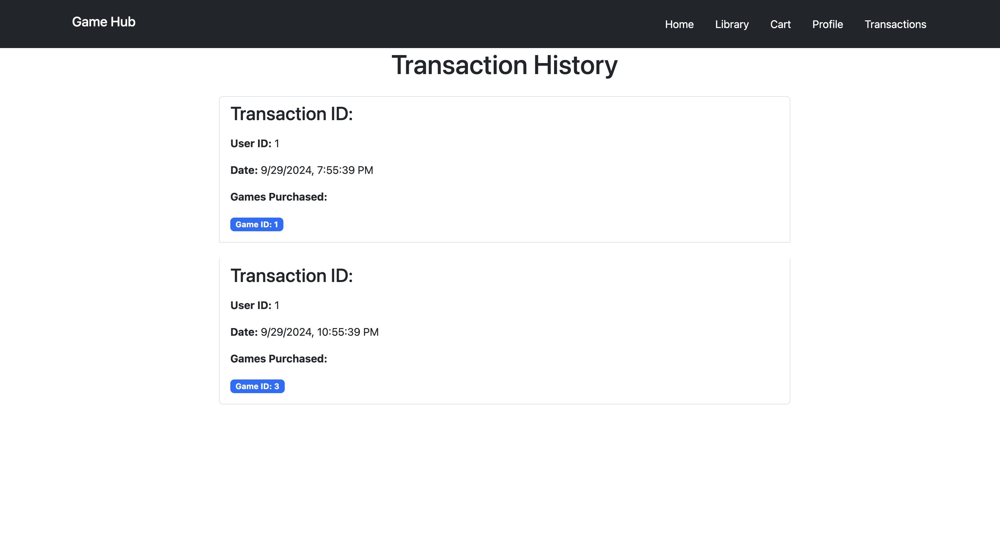
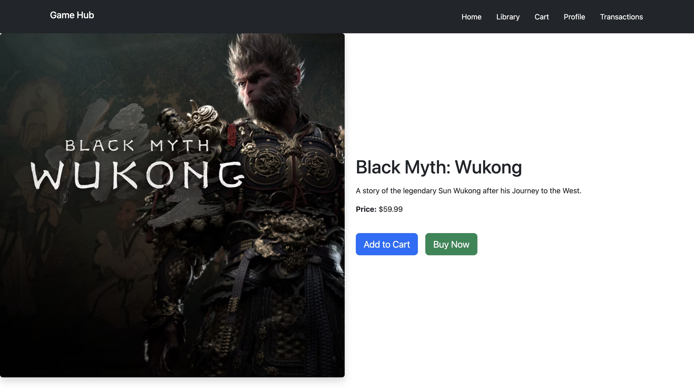

# GameHub for Full-Stack CRUD App.
Project name - GameHub 

 Shwan Myat Nay Chi(https://gamehub-hy96k1dl1-shwan26s-projects.vercel.app/) 
 Min Thuka (https://gamehub-hy96k1dl1-shwan26s-projects.vercel.app/)

 Project description - Our project is for the gamer who want to play the game in easy way with user friendly application . We make our projects base on real game launcher named EPIC Game Launcher . We maily have 5 pages and home , library , cart , profile and transaction .We can view game detail . We can add games to our cart .If we make a payment , the game will appear on the library and we can also remove it from the library .

## Screenshots

Here is a screenshot of the application:









# CRUD operation for User Data Model
```bash
# Get All Users
curl -X GET http://localhost:3000/api/users

# Create a New User
curl -X POST http://localhost:3000/api/users -H "Content-Type: application/json" -d '{"id": 3, "name": "John Doe", "cart": [], "library": []}'

# Get User by ID
curl -X GET http://localhost:3000/api/users/3

# Update User
curl -X PUT http://localhost:3000/api/users/3 -H "Content-Type: application/json" -d '{"id": 3, "name": "Jane Doe", "cart": [], "library": []}'

# Delete User
curl -X DELETE http://localhost:3000/api/users/3
```

# CRUD operation for Transactions Data Model
```bash
## Get All Transactions
curl -X GET http://localhost:3000/api/transactions```

## Create a New Transaction
curl -X POST http://localhost:3000/api/transactions -H "Content-Type: application/json" -d '{"id": 4, "userId": 1, "gameId": 1, "date": "2024-09-29", "amount": 19.99}'

## Get Transaction by ID
curl -X GET http://localhost:3000/api/transactions/4

## Delete Transaction
curl -X DELETE http://localhost:3000/api/transactions/4
```

# CRUD operation for Games Data Model
```bash
## Get All Games
curl -X GET http://localhost:3000/api/games

## Create a New Game
curl -X POST http://localhost:3000/api/games -H "Content-Type: application/json" -d '{"id": 13, "title": "Sample Game", "description": "This is a sample game description.", "price": 29.99}'

## Get Game by ID
curl -X GET http://localhost:3000/api/games/13

## Update Game
curl -X PUT http://localhost:3000/api/games/13 -H "Content-Type: application/json" -d '{"id": 13, "title": "Updated Sample Game", "description": "This is an updated sample game description.", "price": 24.99}'

# Delete Game
curl -X DELETE http://localhost:3000/api/games/13
```

